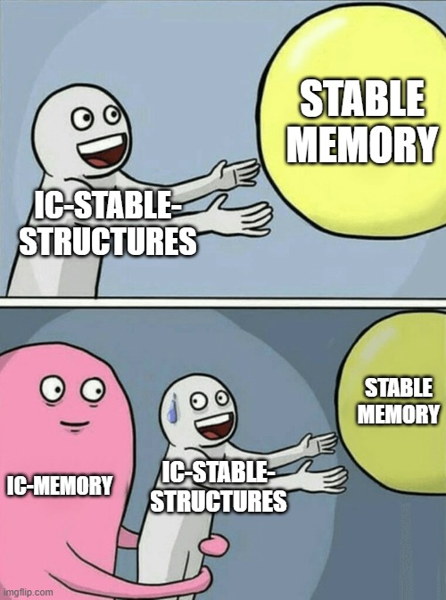

# ic-memory

<p align="center">
  
</p>

<p align="center">
  <strong>EARLY INFRASTRUCTURE: validate before opening stable memory.</strong>
</p>

---

`ic-memory` helps Internet Computer canisters avoid opening the wrong stable
memory after an upgrade.

The invariant:

> Once a stable key is committed to a physical allocation slot, future binaries
> must either reopen that same stable key on that same slot or declare a new
> stable key.

It remembers this mapping forever:

```text
logical store -> physical stable-memory slot
```

If a future version tries to move that store to a different slot, or reuse that
slot for a different store, `ic-memory` rejects the layout before stable-memory
handles are opened.

The meme is funny. The bug is not.

<p align="center">
  
</p>

## Why Use It?

Use `ic-memory` when a canister has more than one stable store and the layout
can change over time.

It is most useful for:

- IC frameworks
- generated canisters
- multi-store canisters
- plugin or module systems
- canister families that evolve across releases
- any project where stable-memory ID reuse would be a serious bug

You probably do not need it for a tiny canister with one hand-written stable
structure and a fixed layout.

## What It Protects Against

The dangerous bug is slot drift.

Version 1 ships with:

```text
app.users.v1  -> MemoryManager ID 100
app.orders.v1 -> MemoryManager ID 101
```

A later upgrade accidentally ships with:

```text
app.users.v1  -> MemoryManager ID 101
app.orders.v1 -> MemoryManager ID 100
```

That can still compile. It can even install.

But now the canister may open orders data as users data, and users data as
orders data (or more likely just fail to deserialize anything.)

`ic-memory` catches that mismatch first.

It enforces both directions for active allocations:

- The same active stable key cannot move to a different physical slot.
- The same active physical slot cannot be reused by a different stable key.

<p align="center">
  
</p>

## How It Fits

`ic-stable-structures` stores the data.

`ic-memory` checks that each logical store is still opening the same physical
slot it owned before.

The native IC ledger anchor is:

```text
MemoryManager ID 0
  -> ic-stable-structures::Cell<StableCellLedgerRecord, _>
  -> LedgerCommitStore
  -> dual protected committed AllocationLedger payloads
```

`CborLedgerCodec` is the built-in codec for those committed ledger payloads.

A typical framework flow is:

1. Recover the saved allocation ledger.
2. Declare the stores this binary expects.
3. Validate those declarations against history and policy.
4. Commit the new generation.
5. Open stable-memory handles only after validation passes.

The important rule: validate layout before touching stable data.

Do not rawdog stable-memory IDs.

## Golden Path

The native ledger anchor is an `ic-stable-structures::Cell` at `MemoryManager`
ID 0. `AllocationBootstrap` is the golden path for whichever layer owns that
ledger store.

Supported ownership modes:

- Framework-owned bootstrap: Canic owns the allocation ledger bootstrap, and
  IcyDB/application declarations flow through Canic.
- Library-owned bootstrap: IcyDB may use `ic-memory` directly without Canic,
  and applications using IcyDB rely on IcyDB's bootstrap.
- Application-owned bootstrap: a standalone canister may use `ic-memory`
  directly without Canic or IcyDB.

Exactly one owner should bootstrap a given `ic-memory` ledger store. If
multiple layers use `ic-memory` in the same canister, they must either compose
declarations into one bootstrap owner or use distinct ledger stores and
allocation domains.

The safe order is fixed for every owner:

```text
recover persisted allocation ledger
declare this binary's expected stable stores
validate declarations against ledger/history/policy
commit the new generation
only then open stable-memory handles
```

Minimal sketch:

```ignore
let ledger = recover_allocation_ledger()?;

let declarations = DeclarationCollector::new()
    .with_memory_manager("app.orders.v1", 100, "orders")?
    .seal()?;

let mut bootstrap = AllocationBootstrap::new(record.store_mut());
let commit = bootstrap.initialize_validate_and_commit(
    &CborLedgerCodec,
    &genesis_ledger,
    declarations,
    &policy,
    runtime_fingerprint,
)?;

let session = AllocationSession::new(storage, commit.validated);
let orders = session.open(&StableKey::parse("app.orders.v1")?)?;
```

The helper names for `record`, `genesis_ledger`, `policy`, and `storage` are
placeholders. Frameworks and libraries wire those to their own stable-memory
persistence and collection construction. The ordering is the contract.

`AllocationLedger::new(...)` builds a structurally valid ledger DTO. Use
`AllocationLedger::new_committed(...)` only when you are manually constructing
committed ledger state and want the stricter committed-generation checks.
Normal integrations should usually recover through the commit/recovery flow
instead of hand-assembling committed state.

## Basic Declaration

Declare every stable store with a stable name and a physical slot:

```rust
use ic_memory::DeclarationCollector;

let snapshot = DeclarationCollector::new()
    .with_memory_manager("app.orders.v1", 100, "orders")
    .expect("valid allocation declaration")
    .seal()
    .expect("valid declaration snapshot");
assert_eq!(snapshot.len(), 1);
```

That snapshot is what you validate against the recovered ledger before opening
the store.

## Stable Keys

Stable keys are permanent logical store names. They should describe ownership
and purpose, not the current memory ID.

Format:

```text
namespace.component.store_or_role.vN
```

Rules:

- ASCII only.
- Lowercase only.
- Dot-separated segments.
- Each segment starts with a lowercase letter.
- Segments may contain lowercase letters, digits, and underscores.
- No whitespace, slashes, or hyphens.
- Must end with a nonzero version suffix such as `.v1` or `.v12`.
- Maximum length is 128 bytes.

Examples:

```rust
use ic_memory::StableKey;

StableKey::parse("app.orders.v1").expect("app key");
StableKey::parse("myapp.audit_log.v1").expect("app key");
StableKey::parse("framework.cache.index.v1").expect("framework key");
StableKey::parse("database.users.data.v1").expect("database key");
```

Suggested namespace conventions:

- `ic_memory.*` is reserved for `ic-memory` governance records.
- Application-owned stores can use an application namespace, such as
  `app.orders.v1` or `myapp.audit_log.v1`.
- Frameworks and generated stores should use namespaces they own, such as
  `framework.cache.index.v1` or `database.users.data.v1`.

Canic and IcyDB examples:

- `canic.core.*` is appropriate for Canic framework-owned stores.
- `icydb.<memory_namespace>.<store_name>.<role>.vN` works for generated IcyDB
  stores, such as `icydb.test_db.users.data.v1`.

Changing a key creates a new logical allocation identity. If the durable store
is the same, keep the stable key and update schema metadata instead.

## Range Authority

Range authority is policy metadata. It does not allocate stable-memory IDs and
does not write to the allocation ledger.

Packages should publish only the ranges they own:

```rust
use ic_memory::{
    IC_MEMORY_AUTHORITY_OWNER, MemoryManagerRangeAuthority, MemoryManagerRangeMode,
    memory_manager_governance_range,
};

let authority = MemoryManagerRangeAuthority::new()
    .reserve(memory_manager_governance_range(), IC_MEMORY_AUTHORITY_OWNER)
    .expect("ic-memory governance range")
    .reserve_ids(10, 99, "framework.example")
    .expect("framework range");

authority
    .validate_id_authority_mode(42, "framework.example", MemoryManagerRangeMode::Reserved)
    .expect("framework-owned ID");
```

An open stack composes records from multiple packages and rejects overlaps:

```rust
use ic_memory::MemoryManagerRangeAuthority;

let framework_records = MemoryManagerRangeAuthority::new()
    .reserve_ids(10, 99, "framework.example")
    .expect("framework range")
    .authorities()
    .to_vec();

let database_records = MemoryManagerRangeAuthority::new()
    .reserve_ids(120, 149, "database.framework")
    .expect("database range")
    .authorities()
    .to_vec();

let authority = MemoryManagerRangeAuthority::from_records(
    framework_records
        .into_iter()
        .chain(database_records)
        .collect(),
)
.expect("non-overlapping package ranges");

assert_eq!(authority.authorities().len(), 2);
```

A final closed policy may claim the remaining application space and require full
coverage:

```rust
use ic_memory::{
    IC_MEMORY_AUTHORITY_OWNER, MEMORY_MANAGER_MAX_ID, MemoryManagerIdRange,
    MemoryManagerRangeAuthority, memory_manager_governance_range,
};

let authority = MemoryManagerRangeAuthority::new()
    .reserve(memory_manager_governance_range(), IC_MEMORY_AUTHORITY_OWNER)
    .expect("ic-memory governance range")
    .reserve_ids(10, 99, "framework.example")
    .expect("framework range")
    .allow_ids(100, MEMORY_MANAGER_MAX_ID, "applications")
    .expect("application range");

authority
    .validate_complete_coverage(MemoryManagerIdRange::all_usable())
    .expect("closed policy covers every usable ID");
```

## Current MemoryManager Rules

For the built-in `ic-stable-structures::MemoryManager` slot descriptor:

- IDs `0..=254` are usable stable-memory slots.
- ID `255` is rejected because it is the unallocated sentinel.
- IDs `0..=9` are reserved for `ic-memory` governance.
- ID `0` is assigned to the allocation ledger.

The crate also exposes range-authority helpers for frameworks that want to split
ID ranges between infrastructure and application stores.

Canic currently uses `10..=99` as a framework-reserved example range. That is
Canic policy, not an `ic-memory` rule.

## What It Does Not Do

`ic-memory` does not replace `ic-stable-structures`.

It owns allocation governance. It does not re-export or wrap every
`ic-stable-structures` collection type.

It also does not handle:

- schema migrations
- schema compatibility or data semantics
- controller authorization
- application data validation
- endpoint routing
- IC management-canister calls
- malicious-controller protection
- disaster recovery

It only protects stable-memory allocation ownership.

## Status

`ic-memory` is early infrastructure extracted from Canic. The public API is
intended to stabilize around persistent allocation ownership, but framework
authors should still treat this line as young infrastructure while the
standalone boundary settles.

Earlier drafts exposed some durable DTO fields directly. Current versions use
checked constructors and accessors so invalid allocation state is harder to
construct accidentally.

The non-negotiable invariants are recorded in [SAFETY.md](SAFETY.md).

The protected physical checksum detects torn writes and accidental corruption.
It is not a cryptographic integrity mechanism and must not be treated as
adversarial tamper resistance.
